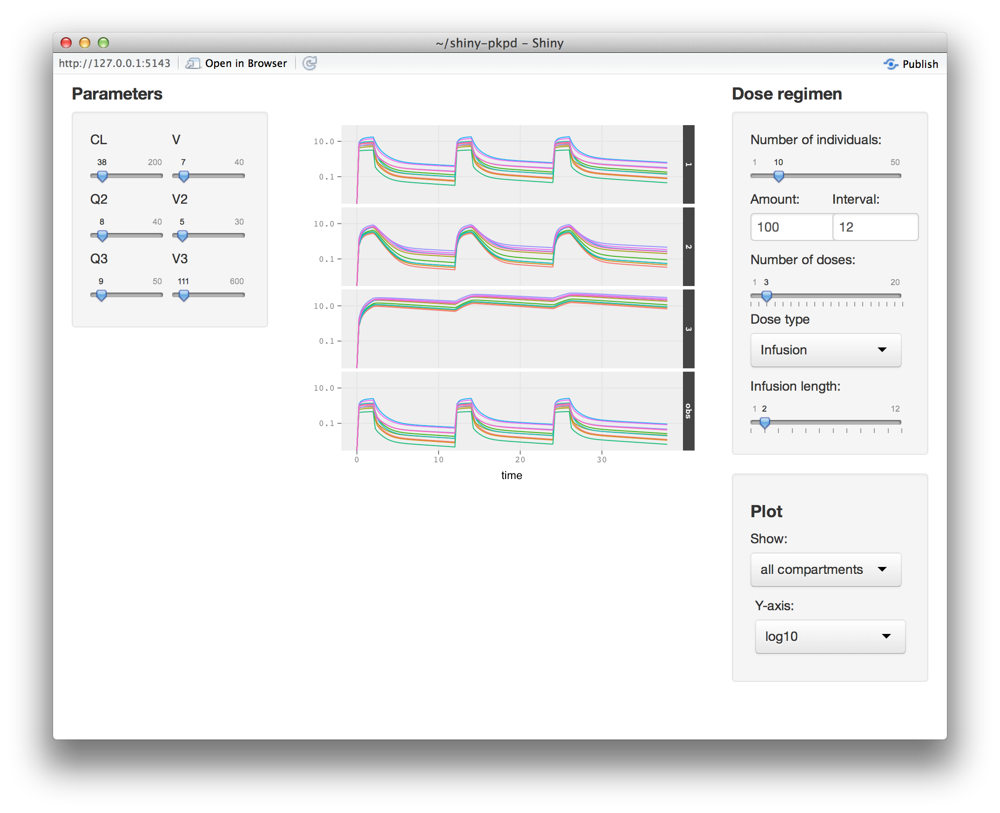

[](https://travis-ci.org/ronkeizer/PKPDsim)

# Description

`PKPDsim` is a library for numerical integration of ODE systems, in particular pharmacokinetic-pharmacodynamic (PK-PD) mixed-effects models. 

In pharmacometrics, models are often defined as systems of ordinary differential equations (ODEs). Although solving ODEs numerically in R is relatively straightforward using the deSolve library, the implementation of e.g. infusions and complex dosing regimens as well as the incorporation of random effects is cumbersome. A tool like Berkeley Madonna provides excellent interactivity features and is fast[1], but is far inferior to R regarding plotting functionality, cumbersome regarding implementation of dose regimens and multi-level variability, and also not open source/free. This is the rationale for developing the PKPDsim library, i.e. to provide a tool that is:

- easy to use, easy to translate from softwares as NONMEM into R
- flexible and can be used for many different purposes: e.g. teaching, clinical trial simulation, curve fitting, etc.
- fast (through use of compiled code)
- facilitates model / parameter exploration by providing dynamically generated Shiny apps



## Comparison to other tools

Many modelers currently resort to Berkeley Madonna (BM) to perform exploratory simulations instead of performing them in R. BM does provide some excellent interactivity features and is fast, but is: 

- much inferior to R regarding plotting functionality
- cumbersome regarding implementation of dose regimens and multi-level variability 
- not open source/free. 

In essence, the `PKPDsim` tool is an attempt to take the best features of BM, and offer them whithin the R environment so that the modeler can take advantage of e.g. the plotting and visualization tools in R. The library aims to facilitate simulation of any dosing regimen for PKPD mixed-effects models. The `PKPDsim` library can dynamically generate Shiny frontends (see figure below) offering features similar to BM. The Shiny app also generates the R code for any plot created in the interface.

Recently, Inria (through the DDMoRe consortium) released a similar library for R (`mlxR`, https://github.com/MarcLavielle/mlxR). The main differences are that `PKPDsim`:

- [+] does not use a proprietary and closed-source simulation engine
- [+/-] does not require/support models written in PharmML
- [+] offers functionality to dynamically generate Shiny apps
- [+] allows specification of PK-PD models by combining separate PK and PD models
- [-] currently does not allow simulation of count data (will follow soon)
- [-] currently does not allow delay differential equations for multidose regimens (will follow)

## Future plans
- release to CRAN
- add more example models / tutorials

## Installation

```
library(devtools)
install_github("ronkeizer/PKPDsim")
library(PKPDsim)
```

## How to use

See [vignette](http://ronkeizer.github.io/PKPDsim/)

## License

[MIT license](http://opensource.org/licenses/MIT)
