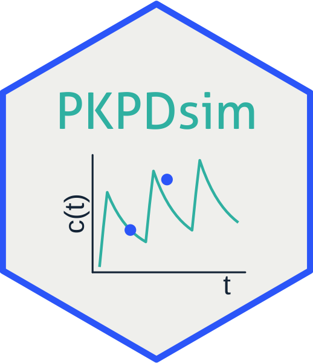

# PKPDsim 

PKPDsim is a library for numerical integration of ODE systems, in particular pharmacokinetic-pharmacodynamic (PK-PD) mixed-effects models.

## Installation

The development version of PKPDsim always has the most up-to-date improvements
and bug fixes. We aim to release PKPDsim on CRAN at least once a year,
depending on the number and impact of updates made to the development version.

The CRAN version of PKPDsim can be installed using:

```
install.packages("PKPDsim")
```

The development version of PKPDsim can be installed using:

```
devtools::install_github("InsightRX/PKPDsim")
```

A number of models from the literature have been made available for use in
PKPD simulations. To see which models are available for installation, run:

```
available_default_literature_models()
```

You can install these models as packages using the following commands:
```
# To install a single model:
install_default_literature_model("pk_busulfan_mccune")
# To install all supplied models:
install_default_literature_model("all")
```

## Contributing

We welcome input from the community:

- If you think you have encountered a bug, please [submit an issue](https://github.com/InsightRX/PKPDsim/issues) 
on the GitHub page. Please include a reproducible example of the unexpected 
behavior.

- Please [open a pull request](https://github.com/InsightRX/PKPDsim/pulls) if
you have a fix or updates that would improve the package. If you're not sure if
your proposed changes are useful or within scope of the package, feel free to
contact one of the authors of this package.

## Disclaimer

The functionality in this R package is provided "as is". While its authors 
adhere to software development best practices, the software may still contain 
unintended errors.

InsightRX Inc. and the authors of this package can not be held liable for any
damages resulting from any use of this software. By the use of this software 
package, the user waives all warranties, expressed or implied, including any 
warranties to the accuracy, quality or suitability of InsightRX for any 
particular purpose, either medical or non-medical.


<div align="right">
© 
</div>
