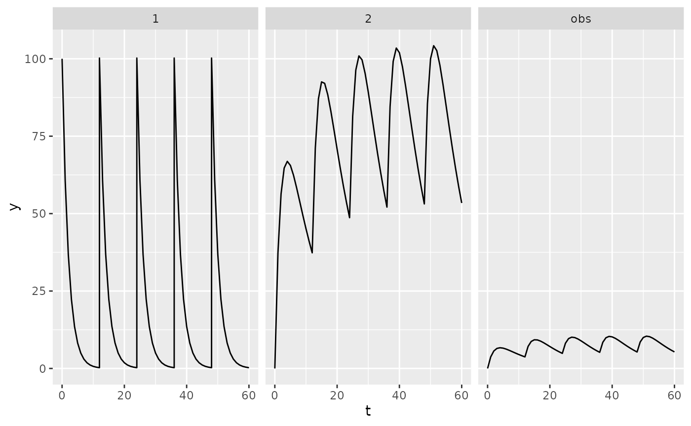
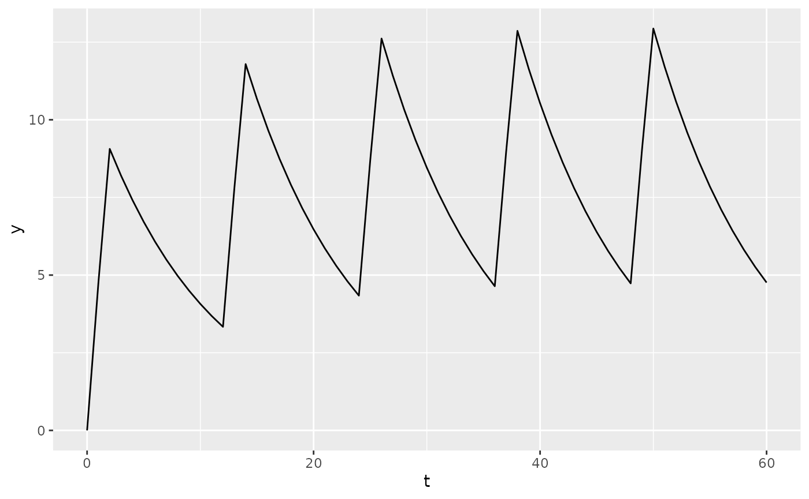

# Getting started

## Installation

PKPDsim can be installed from CRAN:

``` r
install.packages("PKPDsim")
```

Or you can install the development version from GitHub:

``` r
devtools::install_github("InsightRX/PKPDsim")
```

## First simulation

The main simulation function in `PKPDsim` is
[`sim()`](https://insightrx.github.io/PKPDsim/reference/sim.md). To be
able to simulate a dosing regimen for a specific drug, at least the
following **three** arguments are required:

- `ode`: the compiled ODE model (created using the
  [`new_ode_model()`](https://insightrx.github.io/PKPDsim/reference/new_ode_model.md)
  function)
- `parameters`: a `list` of parameter values for the model
- `regimen`: the dosing regimen (created using the
  [`new_regimen()`](https://insightrx.github.io/PKPDsim/reference/new_regimen.md)
  function)

The model library in PKPDsim contains a small library of built-in PK and
PD models, but of course more interesting is its ability to handle
user-specified ODE systems. However, as a first example, let’s implement
the most simple example from the library:

``` r
p <- list(CL = 1, V  = 10, KA = 0.5)
pk1 <- new_ode_model("pk_1cmt_oral")
r1 <- new_regimen(
  amt = 100,
  n = 5,
  interval = 12
)
dat <- sim(
  ode = pk1,
  parameters = p,
  regimen = r1
)
```

You probably noticed that the
[`new_ode_model()`](https://insightrx.github.io/PKPDsim/reference/new_ode_model.md)-step
took a few seconds to finish, while the simulation itself was in the
order of milliseconds. In
[`new_ode_model()`](https://insightrx.github.io/PKPDsim/reference/new_ode_model.md),
the model is compiled from C++ source code to binary code, which takes a
few seconds. However, this has to be done only once. After compilation,
the model is then available to be used in
[`sim()`](https://insightrx.github.io/PKPDsim/reference/sim.md) for as
long as the R session is open.

Let’s look at the output. `PKPDsim` will output data in the “long”
format, i.e. one row per observed timepoint, and split by compartment:

``` r
head(dat)
```

    ##     id t comp        y obs_type
    ## 1    1 0    1  0.00000        1
    ## 4    1 1    1 60.65307        1
    ## 38   1 2    1 36.78794        1
    ## 72   1 3    1 22.31302        1
    ## 106  1 4    1 13.53353        1
    ## 140  1 5    1  8.20850        1

To check what output was produced by
[`sim()`](https://insightrx.github.io/PKPDsim/reference/sim.md), let’s
plot it (installation of `ggplot2` required).

``` r
ggplot(dat, aes(x = t, y = y)) +
  geom_line() +
  facet_wrap(vars(comp))
```



## Custom ODE model

We can write the same exact model using custom ODE code. The following
example will also only output the concentration (`only_obs = TRUE`), and
not the amounts in each compartment. We’re also going to use an infusion
instead of bolus injection:

``` r
pk2 <- new_ode_model(
  code = "dAdt[1] = -(CL/V) * A[1]",
  obs = list(cmt = 1, scale = "V"),
  dose = list(cmt = 1)
)
r2 <- new_regimen(
  amt = 100,
  n = 5,
  interval = 12,
  type = "infusion",
  t_inf = 2
)
dat2 <- sim(
  ode = pk2,
  parameters = p,
  regimen = r2,
  only_obs = TRUE
)
```

``` r
ggplot(dat2, aes(x = t, y = y)) +
  geom_line()
```



## Included models

PKPDsim includes definitions of several PK/PD models used in the
InsightRX platform.

These models can be installed as R packages using the
[`model_from_api()`](https://insightrx.github.io/PKPDsim/reference/model_from_api.md)
function.

``` r
model_from_api(
  system.file("models", "pk_vanco_anderson.json5", package = "PKPDsim"),
  to_package = TRUE,
  install_all = TRUE
)
```

Please note that these models may differ from those used in production
by InsightRX. They are provided for demonstration purposes only, and
should not be used for dosing patients.

### Example usage

To simulate PK, provide the model and parameters to
[`sim()`](https://insightrx.github.io/PKPDsim/reference/sim.md) along
with a dosing regimen and covariates.

``` r
## Create dosing regimen and covariates
reg <- new_regimen(
  amt = 100,
  n = 3,
  interval = 12,
  type = "infusion",
  t_inf = 1
)

covs <- list(
  WT = new_covariate(4),
  PMA = new_covariate(42),
  CR = new_covariate(0.5),
  CL_HEMO = new_covariate(0)
)

## Perform simulation
sim(
  ode = pkvancoanderson::model(),
  parameters = pkvancoanderson::parameters(),
  regimen = reg,
  covariates = covs
)
```
