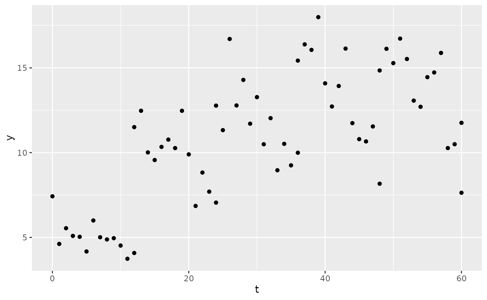
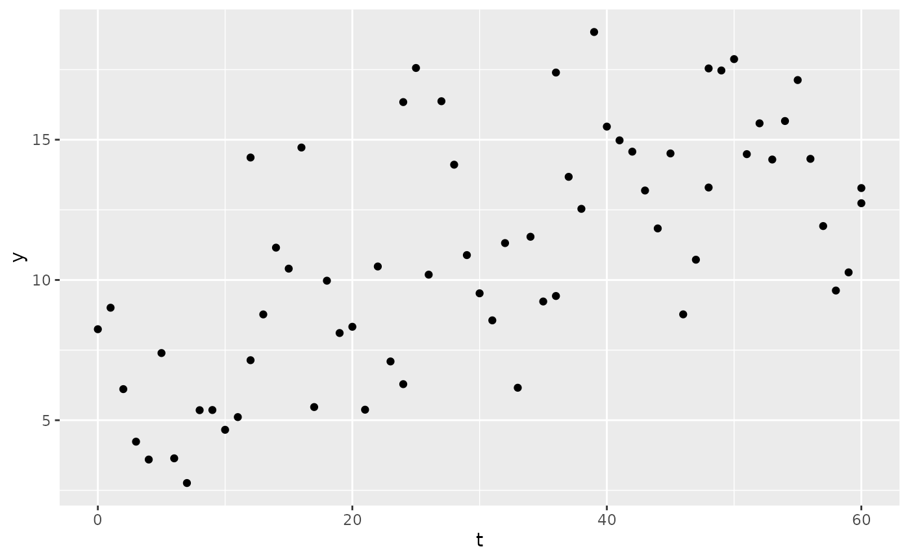

# Residual error

## Residual error

PKPDsim can simulate residual errors in your observed data, which can be
done with the `res_var` argument to the
[`sim()`](https://insightrx.github.io/PKPDsim/reference/sim.md)
function. This argument requires a
[`list()`](https://rdrr.io/r/base/list.html) with one or more of the
following components:

- `prop`: proportional error:
  $$y = \widehat{y} \cdot \left( 1 + \mathcal{N}(0,prop) \right)$$
- `add`: additive error: $$y = \widehat{y} + \mathcal{N}(0,add))$$
- `exp`: exponential error:
  $$y = \widehat{y} \cdot e^{\mathcal{N}{(0,exp)}}$$

These list elements can be combined, e.g. for a combined proportional
and additive error model one would write:
`res_var = list(prop = 0.1, add = 1)`, which would give a 10%
proportional error plus an additive error of 1 concentration unit.

Below are some examples of the `res_var` argument

Combined proportional and additive:

``` r
mod <- new_ode_model("pk_1cmt_iv")
reg <- new_regimen(
  amt = 1000,
  n = 5,
  interval = 12,
  type = "bolus"
)
sim1 <- sim(
  mod,
  parameters = list(CL = 5, V = 150),
  res_var = list(prop = 0.1, add = 1),
  regimen = reg,
  only_obs = TRUE
)
ggplot(sim1, aes(x = t, y = y)) +
  geom_point()
```



Exponential:

``` r
sim2 <- sim(
  mod,
  parameters = list(CL = 5, V = 150),
  res_var = list(exp = 0.1),
  regimen = reg,
  only_obs = TRUE
)
```

Besides including the residual error at simulation time, there is also
the option to include it afterwards. For that, the function
[`add_ruv()`](https://insightrx.github.io/PKPDsim/reference/add_ruv.md)
is useful.

``` r
sim3 <- sim1
sim3$y <- add_ruv(
  x = sim3$y, 
  ruv = list(
    prop = 0.1, 
    add = 1
  )
)
ggplot(sim3, aes(x = t, y = y)) +
  geom_point()
```


