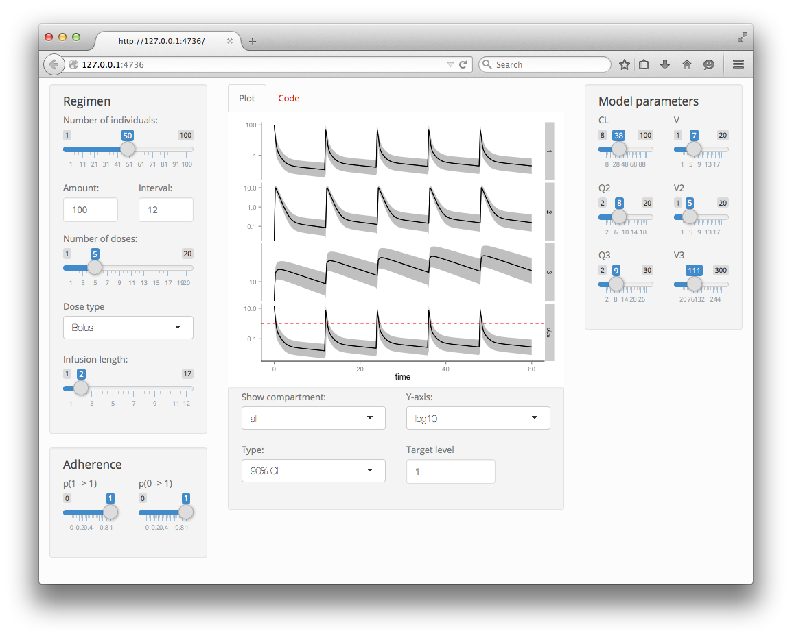

# Introduction

`PKPDsim` is a library for numerical integration of ODE systems, in particular pharmacokinetic-pharmacodynamic (PK-PD) mixed-effects models. 

In pharmacometrics, models are often defined as systems of ordinary differential equations (ODEs). Although solving ODEs numerically in R is relatively straightforward using the deSolve library, the implementation of e.g. infusions and complex dosing regimens as well as the incorporation of random effects is cumbersome. A tool like Berkeley Madonna provides excellent interactivity features and is fast[1], but is far inferior to R regarding plotting functionality, cumbersome regarding implementation of dose regimens and multi-level variability, and also not open source/free. This is the rationale for developing the PKPDsim library, i.e. to provide a tool that is:

- easy to use, easy to translate from softwares as NONMEM into R
- flexible and can be used for many different purposes: e.g. teaching, clinical trial simulation, curve fitting, etc.
- fast (through use of compiled code)

# Features

- facilitates simulation of dosing regimens for PKPD mixed-effects models
- for numerical integration, the module uses the fast Boost C++ library. Alternatively, the `deSolve` library can be used too (see examples below), although simulation will be much slower.
- the PKPDsim library can be used from the R command line, but can also dynamically generate Shiny frontends to allow interactive use for model exploration and teaching purposes.
- the model library in PKPDsim contains a considerable selection of PK and PD models, of which only a few examples are be shown below. But custom models can easily be implemented too, by specifying the differential equations. 

# Installation

```{r, eval=FALSE}
library("devtools")
install_github("ronkeizer/PKPDsim")
library("PKPDsim")
```

```{r, echo=F, warning=F, message=FALSE}
library(PKPDsim)
library(ggplot2)
library(dplyr)
```

## Summary

To perform a simulation, you will only need three functions:

- `new_ode_model()`: defines the ODE system and sets some attributes of the model. The ODE model can be specified in four different ways:

    - `model`: reference to a model from the library included in `PKPDsim`. To show the available models, run `new_ode_model()` without any arguments.
    - `code`: using code specyfing derivatives for ODE specified in C++
    - `file`: similar to `code`, but reads the code from a file
    - `func`: ODE system specified as R function to be used by deSolve (slower)

- `new_regimen()`: defines the dosing regimen
- `sim_ode()`: performs the simulation

## Example: model from library

Specifying a dose regimen, selecting a model from the library, simulating the PK, and plotting:

```{r, warning=F, message=F}
p <- list(CL = 1, V  = 10, KA = 0.5)

pk1 <- new_ode_model("pk_1cmt_oral")

r1 <- new_regimen(amt = 100,
              times = c(0, 12, 24, 36))

dat <- sim_ode (ode = "pk1",
                par = p,
                regimen = r1)

ggplot(dat, aes(x=t, y=y)) +
  geom_line() +
  facet_wrap(~comp) +
  theme_empty()
```

To simulate between-subject variability, just specify the covariance matrix (`omega`) for the parameters: 

```{r, warning=F, message=F}
dat2 <- sim_ode (ode = "pk1",
                par = p,
                n_ind = 40,
                omega = c(0.1, 
                          0.05, 0.1),
                regimen = r1)

ggplot(dat2 %>% filter(comp == "obs"), aes(x=t, y=y, group=id, colour=factor(id))) +
  scale_colour_discrete(guide=FALSE) +
  geom_line() +
  theme_empty()
```

Instead of specifying the `omega` matrix, you can also specify between-subject variability as:

```{r, eval=FALSE}
omega <- omega_to_cv(list("CL" = 0.1, "V" = 0.1))  # values are standard deviations, assuming exponential distribution
```

## Example: custom model

The model definition should be valid C++ syntax. The code syntax is also highly similar to Berkeley Madonna.

```{r, message=F, warning=FALSE}
pk2  <- new_ode_model(code = "
                        dAdt[1] = -KA * A[1]
                        dAdt[2] = KA*A[1] -(CL/V) * A[2]
                      ")
r2 <- new_regimen(amt = 100,
              times = c(0, 12, 24, 36))

dat <- sim_ode (ode = "pk2",
                n_ind = 25,
                omega = cv_to_omega(par_cv = list("CL"=0.1, "V"=0.1, "KA" = .1), p),
                par = p,
                regimen = r2,
                verbose = FALSE)

ggplot(dat, aes(x=t, y=y, colour=factor(id))) +
  geom_line() +
  scale_colour_discrete(guide=FALSE) +
  facet_wrap(~comp, scales="free") + 
  theme_empty()
```

## Example: PK-PD model

Below is an example of a simple indirect-response model. With PK-PD models, the inital state of the PD system often depends on specific model parts. We can define the state of the ODE system statically using the `A_init=` argument, but this will not any (individual) parameters into account. However, we can also define initial states dynamically using the `state_init` argument, so that for each inidividual the desired initial state will be calculated:

```{r, message=F, warning=FALSE}
p_pkpd <- list(CL = 5, V  = 50,
               KIN = .02, KOUT=.5, EFF = 0.2)

pkpd <- new_ode_model(
  code = "
    dAdt[1] = -(CL/V) * A[1] + rate
    conc = A[1]/V;
    dAdt[2] = KIN * 1/(1+EFF*conc) - KOUT*A[2];
  ", 
  state_init = "A[2] = KIN/KOUT;"
)

dat <- sim_ode (ode = "pkpd",
                n_ind = 25,
                omega = cv_to_omega(par_cv = list("CL"=0.1, "V"=0.1, "KIN" = .05, "KOUT"= 0.1), p),
                par = p_pkpd,
                regimen = r1,
                verbose = FALSE)

ggplot(dat, aes(x=t, y=y, colour=factor(id))) +
  geom_line() +
  scale_colour_discrete(guide=FALSE) +
  facet_wrap(~comp, scales="free") + 
  theme_empty()
```


## Example: combine PK and PD models

As shown above, a PK-PD model can be written as a single set of differential equations. However, we often develop PK and PD models separately and e.g. want to plug various PK models into existing PD models. This can be done easily in `PKPDsim` by specifying the model parts in a list to the `code` argument: 

```{r, eval=F, message=F, warning=FALSE}
pkpd <- new_ode_model(code = list(pk = "
                                    dAdt[1] = -(CL/V) * A[1] + rate;
                                    conc = A[1]/V;
                                  ",
                                  pd = "
                                    dAdt[1] = KIN * 1/(1+EFF*conc) - KOUT*A[1];
                                  "),
                      state_init = list(pd = "A[1] = KIN/KOUT;"))
```


## Example custom ODE using R::deSolve

This approach is much slower than specifying the function as C++ as shown above, but it does not require compilation of the code. It is not the recommended approach, but it is perfectly usable for simulation of single patients or small patient groups. To use this approach, specify an R function to the `func` argument in `new_ode_model()`. The function should be a valid R function that takes three arguments and returns the derivatives of the ODE system as a vector inside a list (see `deSolve` library for further details).0

```{r, warning=F, message=F}
p <- list(CL = 1, V  = 10)

pk_1cmt_iv <- function (t, A, p) {
  with(p, {
    KEL <-  CL/V
    dAdt_1 <- -KEL*A[1] + rate
    return ( list ( c (  dAdt_1 ) ) )
  })
}

r3 <- new_regimen(amt = 100,
              times = c(0, 12, 24, 36),
              type = "infusion", t_inf = 2)

pk3 <- new_ode_model(func = pk_1cmt_iv,
                     obs = list (cmt = 1, scale = "V"))

dat <- sim_ode (ode = "pk3",
                par = p,
                regimen = r3)

ggplot(dat, aes(x=t, y=y)) +
  geom_line() +
  facet_wrap(~comp) +
  theme_empty()
```


## Example Shiny

The code below will create a Shiny app on-the-fly:

```{r, warning=F, eval=FALSE, message=F, message=F}
p <- list(CL = 38.48,
          V  = 7.4,
          Q2 = 7.844,
          V2 = 5.19,
          Q3 = 9.324,
          V3 = 111)

omega <- c(0.3,       # IIV CL
           0.1, 0.3)  # IIV V

pk3cmt <- new_ode_model(func = "pk_3cmt_iv")

sim_ode_shiny(ode = "pk_3cmt",
              par = p,
              regimene = r1,
              omega = omega)
```





## Troubleshooting

If you encounter the following message when trying to run a Shiny app:

```
Error in handler(req) : 
   argument "metaHandler" is missing, with no default 
```      

you should update the Shiny library:

```
install.packages("shiny")
```

